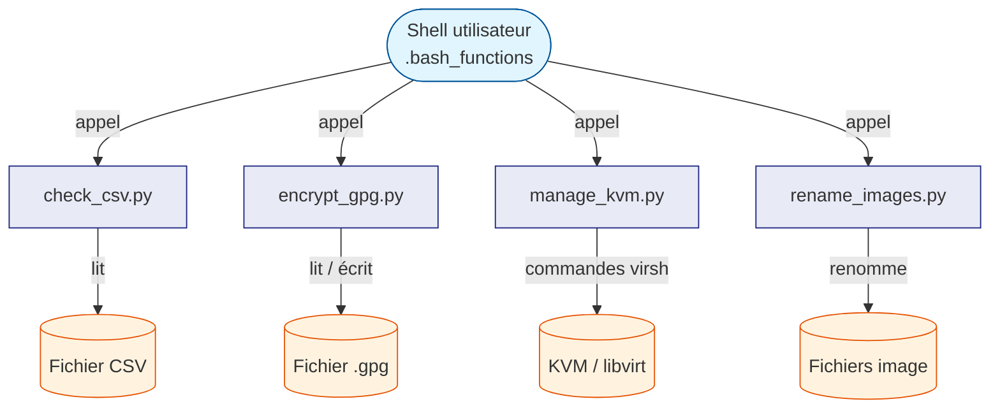

# Documentation des outils `.functions/tools`

Ce répertoire documente les quatre scripts Python disponibles dans
`.functions/tools/`. Ces outils sont conçus pour être appelés depuis
les fonctions shell définies dans `.bash_functions`.

---

## Vue d'ensemble

### check_csv.py — Vérificateur CSV

Vérifie que toutes les lignes d'un fichier CSV ont le même nombre
de colonnes. → [Documentation complète](check_csv.md)

### encrypt_gpg.py — Chiffrement GPG

Chiffre ou déchiffre un fichier via GPG avec un mot de passe.
→ [Documentation complète](encrypt_gpg.md)

### manage_kvm.py — Gestionnaire KVM

Interface texte interactive pour gérer les machines virtuelles KVM.
→ [Documentation complète](manage_kvm.md)

### rename_images.py — Renommage d'images

Renomme en lot des fichiers image avec un préfixe et un numéro.
→ [Documentation complète](rename_images.md)

---

## Architecture générale



---

## Comment ces outils sont-ils invoqués ?

Les fonctions dans `.bash_functions` servent de point d'entrée
depuis le terminal. Elles appellent les scripts Python avec les
bons arguments automatiquement.

```bash
# Vérifier un fichier CSV
check_csv mon_fichier.csv

# Renommer des images
rename_images vacances

# Chiffrer / déchiffrer un fichier
gpg_tool

# Gérer les VMs KVM
kvm_admin
```

> **Pour les débutants** : vous n'avez jamais à appeler les scripts
> Python directement. Les commandes courtes ci-dessus sont les seules
> que vous aurez à retenir.

---

## Prérequis communs

- **Python 3.10+** — requis par tous les scripts
- **`uv`** — gestionnaire de paquets Python du projet
  (utilisez `uv run <script>` pour exécuter un script)
- Dépendances spécifiques à chaque outil listées dans leur page
