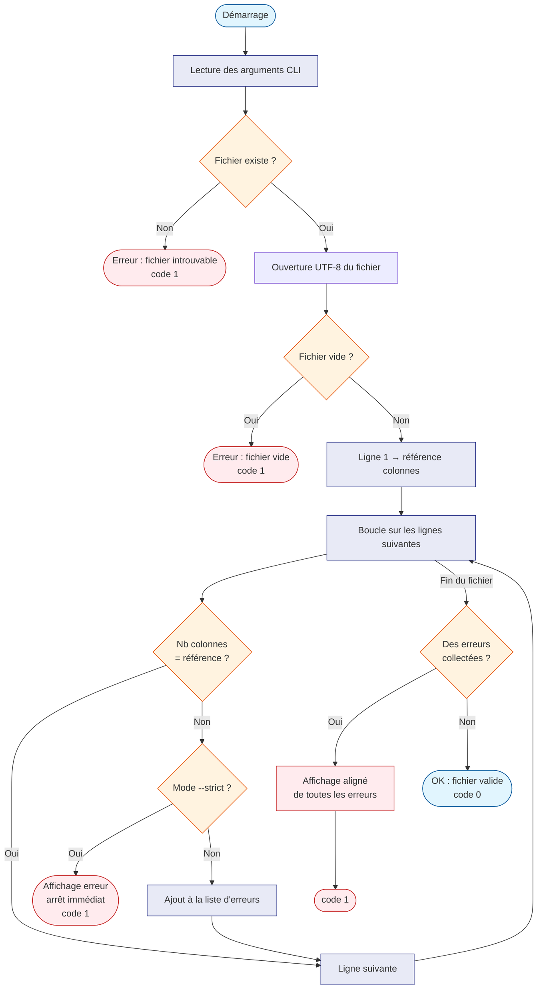

# check_csv.py — Vérificateur de fichiers CSV

## Qu'est-ce que c'est ?

Un fichier CSV est un tableau de données textuelles où chaque ligne
représente une rangée du tableau, et les colonnes sont séparées par
un caractère spécial (virgule, point-virgule, tabulation, etc.).

Ce script vérifie que **toutes les lignes ont le même nombre de
colonnes**. C'est utile pour détecter des erreurs de saisie avant
d'importer les données dans un tableur ou un programme.

> **Pour les débutants** : imaginez un tableau Excel où certaines
> lignes auraient trop ou pas assez de cellules. Ce script détecte
> exactement ces anomalies.

---

## Utilisation

```bash
# Vérification simple (délimiteur par défaut : ;)
python check_csv.py -f mon_fichier.csv

# Avec un délimiteur virgule
python check_csv.py -f donnees.csv -d ','

# Avec un délimiteur tabulation
python check_csv.py -f export.tsv -d '\t'

# Mode strict : s'arrête à la première erreur
python check_csv.py -f fichier.csv --strict

# Mode silencieux : aucune sortie, juste le code retour
python check_csv.py -f fichier.csv -q
```

### Arguments disponibles

| Argument | Requis | Description |
|---|---|---|
| `-f` / `--infile` | Oui | Fichier CSV à analyser |
| `-d` / `--delimiter` | Non (`;`) | Séparateur de colonnes |
| `-q` / `--quiet` | Non | Supprime tous les messages |
| `--strict` | Non | Arrêt à la première erreur |

### Codes de retour shell

- `0` → fichier valide
- `1` → fichier invalide, introuvable ou vide

---

## Fonctionnement technique

1. Le script ouvre le fichier en encodage UTF-8.
2. Il lit la **première ligne** pour compter les colonnes attendues.
3. Si le fichier est vide, il s'arrête avec un message clair.
4. Il compare chaque ligne suivante à ce nombre de référence.
5. En mode `--strict`, il affiche l'erreur et s'arrête aussitôt.
6. En mode normal, il collecte toutes les erreurs et les affiche
   alignées à la fin.
7. Si tout est correct, il affiche un message de confirmation.

---

## Algorithme



---

## Exemple de sortie

Fichier valide :

```
OK : 'donnees.csv' est valide (5 colonnes, aucune erreur détectée).
```

Fichier invalide (mode normal) :

```
Le fichier 'export.csv' comporte 5 colonnes.
Des erreurs ont été détectées :
  Ligne  12: 4 colonnes trouvées (attendu : 5).
  Ligne  47: 6 colonnes trouvées (attendu : 5).
  Ligne 103: 3 colonnes trouvées (attendu : 5).
```

---

## Dépendances

Uniquement la bibliothèque standard Python — aucune installation
requise.

| Module | Rôle |
|---|---|
| `csv` | Lecture et découpage du fichier CSV |
| `argparse` | Gestion des arguments en ligne de commande |
| `os` | Vérification de l'existence du fichier |
| `sys` | Code de retour shell (`sys.exit`) |
