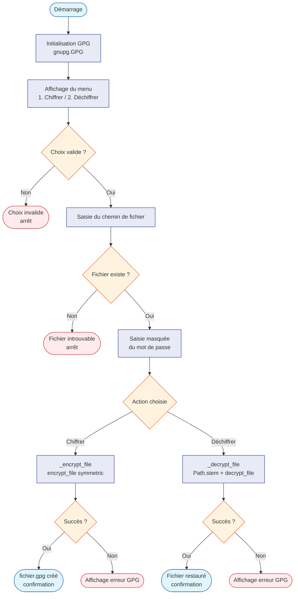

# encrypt_gpg.py — Chiffrement / Déchiffrement GPG

## Qu'est-ce que c'est ?

GPG (GNU Privacy Guard) est un outil standard pour protéger des
fichiers confidentiels avec un mot de passe. Ce script offre une
**interface interactive** pour chiffrer ou déchiffrer n'importe
quel fichier, sans avoir à retenir les options GPG complexes.

> **Pour les débutants** : chiffrer un fichier, c'est le
> "verrouiller" avec un mot de passe. Seule une personne connaissant
> ce mot de passe pourra l'ouvrir. Le fichier chiffré porte
> l'extension `.gpg`.

---

## Utilisation

```bash
python encrypt_gpg.py
```

Le programme pose trois questions :

1. **Que veux-tu faire ?** → `1` pour chiffrer, `2` pour déchiffrer
2. **Chemin du fichier** → le chemin vers le fichier à traiter
3. **Mot de passe GPG** → saisi de façon masquée (invisible à l'écran)

---

## Ce que le programme produit

| Opération | Fichier d'entrée | Fichier produit |
|---|---|---|
| Chiffrement | `rapport.pdf` | `rapport.pdf.gpg` |
| Déchiffrement | `rapport.pdf.gpg` | `rapport.pdf` |

---

## Fonctionnement technique

Le script utilise le chiffrement **symétrique** : un seul mot de
passe protège et déprotège le fichier (pas besoin de clé publique
ou privée).

Le code est organisé en trois fonctions distinctes :

- **`gpg_interact()`** : pose les questions à l'utilisateur et
  appelle la bonne fonction selon le choix.
- **`_encrypt_file()`** : ouvre le fichier en lecture binaire et
  appelle `gpg.encrypt_file(..., symmetric=True)`.
- **`_decrypt_file()`** : ouvre le fichier `.gpg` et appelle
  `gpg.decrypt_file(...)`. Le nom du fichier restauré est calculé
  avec `pathlib.Path.stem` pour retirer proprement l'extension
  `.gpg` (ex : `rapport.pdf.gpg` → `rapport.pdf`).

Le mot de passe est demandé via `getpass` : il n'apparaît jamais
en clair dans le terminal.

Le moteur GPG (`gnupg.GPG()`) est initialisé à l'intérieur de la
fonction, et non au niveau du module, pour éviter tout effet de
bord lors d'un import.

---

## Algorithme



---

## Exemple de session

```
🔐 Bienvenue dans l'outil GPG interactif
1. Chiffrer un fichier
2. Déchiffrer un fichier
Que veux-tu faire ? (1/2) : 1
Chemin du fichier : /home/user/rapport.pdf
Mot de passe GPG :
✅ Fichier chiffré créé : /home/user/rapport.pdf.gpg
```

---

## Dépendances

| Paquet | Installation | Rôle |
|---|---|---|
| `python-gnupg` | `uv add python-gnupg` | Pont Python vers GPG |
| `gpg` (système) | `sudo apt install gnupg` | Moteur de chiffrement |
| `getpass` | stdlib Python | Saisie masquée du mot de passe |
| `pathlib` | stdlib Python | Calcul du nom de fichier restauré |
