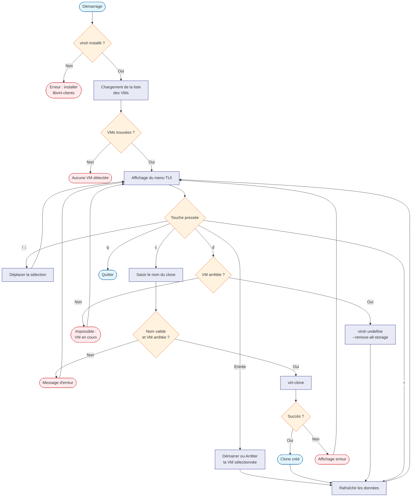

# manage_kvm.py — Gestionnaire de machines virtuelles KVM

## Qu'est-ce que c'est ?

KVM (Kernel-based Virtual Machine) permet de faire tourner plusieurs
systèmes d'exploitation en parallèle sur une seule machine physique.
Ce script offre une **interface texte interactive (TUI)** dans le
terminal pour gérer ces machines virtuelles sans avoir à retenir les
commandes `virsh`.

> **Pour les débutants** : imaginez un panneau de contrôle qui
> s'affiche dans votre terminal. Vous naviguez avec les flèches du
> clavier pour démarrer, arrêter, cloner ou supprimer des machines
> virtuelles.

---

## Utilisation

```bash
python manage_kvm.py
```

L'interface s'ouvre directement dans le terminal. Aucun argument
n'est nécessaire.

### Raccourcis clavier

| Touche | Action |
|---|---|
| `↑` / `↓` | Naviguer dans la liste des VMs |
| `Entrée` | Démarrer ou arrêter la VM sélectionnée |
| `c` | Cloner la VM sélectionnée |
| `d` | Supprimer la VM sélectionnée (si arrêtée) |
| `r` | Rafraîchir la liste |
| `q` | Quitter |

---

## Ce que l'interface affiche

```
🖥️  Gestion des machines virtuelles KVM
────────────────────────────────────────────────────
ID  Nom VM           État      IP             Action
────────────────────────────────────────────────────
1   debian-dev       running   192.168.1.10   Arrêter
2   ubuntu-test      shut off  N/A            Démarrer
3   windows-sandbox  shut off  N/A            Démarrer
```

---

## Fonctionnement technique

Le script utilise deux bibliothèques clés :

- **`curses`** : bibliothèque standard Python pour construire des
  interfaces texte interactives dans le terminal (navigation au
  clavier, mise en surbrillance, etc.)
- **`subprocess`** : exécute les commandes `virsh` et `virt-clone`
  installées sur le système pour interagir avec KVM.

### Points d'amélioration notables

- **Actions lisibles** : le choix de l'action à afficher (Démarrer,
  Arrêter, N/A) est calculé avec un `if/elif/else` clair plutôt
  qu'un ternaire chaîné difficile à lire.
- **Regex sécurisée** : l'adresse MAC est protégée avec
  `re.escape()` avant d'être insérée dans la regex ARP, pour éviter
  que les caractères `:` ne soient interprétés.
- **Type hints** : toutes les fonctions sont typées pour documenter
  les données attendues et retournées.

### Commandes système utilisées en arrière-plan

| Action | Commande exécutée |
|---|---|
| Lister les VMs | `virsh list --all --name` |
| État d'une VM | `virsh domstate <nom>` |
| Adresse MAC | `virsh domiflist <nom>` |
| Adresse IP | `arp -an` puis `ip neigh` |
| Démarrer | `virsh start <nom>` |
| Arrêter | `virsh shutdown <nom>` |
| Cloner | `virt-clone --original <nom> --name <clone>` |
| Supprimer | `virsh undefine <nom> --remove-all-storage` |

---

## Algorithme



---

## Dépendances

| Composant | Installation | Rôle |
|---|---|---|
| `curses` | stdlib Python | Interface texte interactive |
| `subprocess` | stdlib Python | Commandes système |
| `re` | stdlib Python | Recherche regex dans la table ARP |
| `libvirt-clients` | `sudo apt install libvirt-clients` | `virsh` |
| `virtinst` | `sudo apt install virtinst` | `virt-clone` |

> **Attention** : la suppression d'une VM avec `--remove-all-storage`
> efface également son disque virtuel. Cette action est
> **irréversible**.
