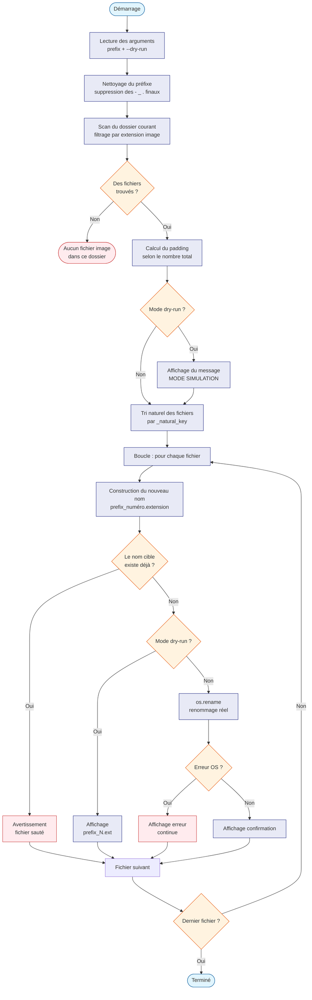

# rename_images.py — Renommage en lot de fichiers image

## Qu'est-ce que c'est ?

Ce script renomme automatiquement tous les fichiers image d'un dossier
en leur donnant un nom cohérent : un **préfixe** de votre choix suivi
d'un **numéro** incrémental.

> **Pour les débutants** : si vous avez 50 photos qui s'appellent
> `DSC_0042.jpg`, `IMG_3821.png`, etc., ce script les renommera
> proprement en `vacances_01.jpg`, `vacances_02.png`, etc. en une
> seule commande.

---

## Utilisation

```bash
# Renommer toutes les images du dossier courant
python rename_images.py vacances

# Prévisualiser sans rien modifier (mode dry-run)
python rename_images.py vacances --dry-run
```

### Arguments

| Argument | Obligatoire | Description |
|---|---|---|
| `prefix` | Oui | Texte placé avant le numéro dans le nouveau nom |
| `--dry-run` | Non | Affiche les renommages sans les effectuer |

---

## Formats d'images supportés

`bmp`, `gif`, `jpeg`, `jpg`, `mp4`, `png`, `tif`, `tiff`, `webm`,
`webp`

---

## Numérotation automatique

Le script adapte le nombre de chiffres selon la quantité de fichiers :

| Nombre de fichiers | Format | Exemple |
|---|---|---|
| 1 à 9 | 1 chiffre | `photo_1.jpg` |
| 10 à 99 | 2 chiffres | `photo_01.jpg` |
| 100 à 999 | 3 chiffres | `photo_001.jpg` |

---

## Fonctionnement technique

### Tri naturel

Le tri alphabétique classique place `img10` avant `img2` car le
caractère `'1'` est inférieur à `'2'`. Le script utilise un **tri
naturel** : il extrait les nombres dans les noms de fichiers et les
compare comme des entiers, ce qui donne l'ordre attendu.

```
Tri alphabétique : img1, img10, img2, img20
Tri naturel      : img1, img2, img10, img20   ← correct
```

### Nettoyage du préfixe

Les caractères `-`, `_` et `.` en fin de préfixe sont supprimés
automatiquement pour éviter les doublons comme `vacances__01.jpg` :

```
"vacances_"  →  "vacances"
"trip-"      →  "trip"
```

### Sécurité

Si le fichier cible existe déjà, le script le **saute** sans écraser
pour ne pas perdre de données.

---

## Algorithme



---

## Exemple de sortie

```bash
$ python rename_images.py vacances --dry-run
Mode dry-run — aucun fichier ne sera modifié.

[dry-run] DSC_0042.jpg  -> vacances_01.jpg
[dry-run] IMG_3821.png  -> vacances_02.png
[dry-run] photo10.webp  -> vacances_03.webp

$ python rename_images.py vacances
DSC_0042.jpg  -> vacances_01.jpg
IMG_3821.png  -> vacances_02.png
photo10.webp  -> vacances_03.webp
```

---

## Dépendances

Uniquement la bibliothèque standard Python — aucune installation
requise.

| Module | Rôle |
|---|---|
| `os` | Lecture du dossier et renommage des fichiers |
| `re` | Tri naturel par extraction des nombres |
| `argparse` | Gestion des arguments en ligne de commande |
